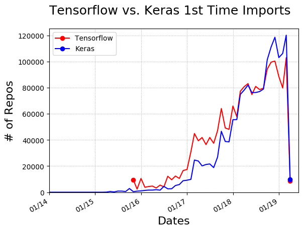

# AI Frameworks
A study of the spread and prevalence of AI frameworks used in jupyter notebooks


The research questions is what is the uptake of AI frameworks in publi jupyter notebooks

We utilize WoC infrastructure ad follow following steps:

1. Identify files that are jupyter notebooks
(how)
```
if test $LA = 'ipy'; then grepStr='\.(ipynb|IPYNB);'; fi
```
2. Obtain all the blobs associated with all versions of these files
```
grepStr=$(echo $grepStr|sed 's/;$/$/;s/\^/;/g')

for j in {0..31}
do zcat ../c2fb/b2fFull$ver$j.s | grep -E "$grepStr" | perl -I /nics/b/home/audris/lib/perl5 -I /nics/b/home/au
    dris/lookup -e 'use cmt; while(<STDIN>){ ($b, @r) = split(/;/); print $_ if ! defined $badBlob{$b};}' | gzip >
    b2f$ver$LA.$j.gz &   
done
wait
echo b2f$ver$LA.$j.gz
```
3. Extract import/from statements by parsing these blobs
```
for j in {0..31}
 do /nics/b/home/audris/bin/lsort ${maxM}G -t\; -k1b,1 --merge \
        <(zcat b$ver${LA}pkgs.$j.gz | lsort ${maxM}G -t\; -k1b,1) \
        <(zcat b$ver${LA}pkgs.$(($j+32)).gz | lsort ${maxM}G -t\; -k1b,1) \
        <(zcat b$ver${LA}pkgs.$(($j+64)).gz | lsort ${maxM}G -t\; -k1b,1) \
        <(zcat b$ver${LA}pkgs.$(($j+96)).gz | lsort ${maxM}G -t\; -k1b,1) | \
        perl -ane 'print if m/^[0-f]{40};/' | uniq |  gzip > b$ver${LA}pkgs.$j.s &      
done
wait
echo b$ver${LA}pkgs.$j.s
```
4. Use time of the associated commit to determine the first time the import statement was created

```
 dict = {}
 for i in range(32):
     command = "zcat /data/play/" + dir_lang + "thruMaps/c2bPtaPkgO" + dir_lang + "." + str(i) + ".gz"
     p1 = subprocess.Popen(command, shell=True, stdout=subprocess.PIPE)
     p2 = subprocess.Popen("grep " + module, shell=True, stdin=p1.stdout,stdout=subprocess.PIPE)
     output = p2.communicate()[0]
     
     for entry in str(output).rstrip('\n').split("\n"):
         entry = str(entry).split(";")        
         repo, time = entry[1], entry[2]         
         if repo not in dict.keys() or time < dict[repo]:        
             for word in entry[5:]:            
                  if module in word:              
                       dict[repo] = time                  
                       break
```


